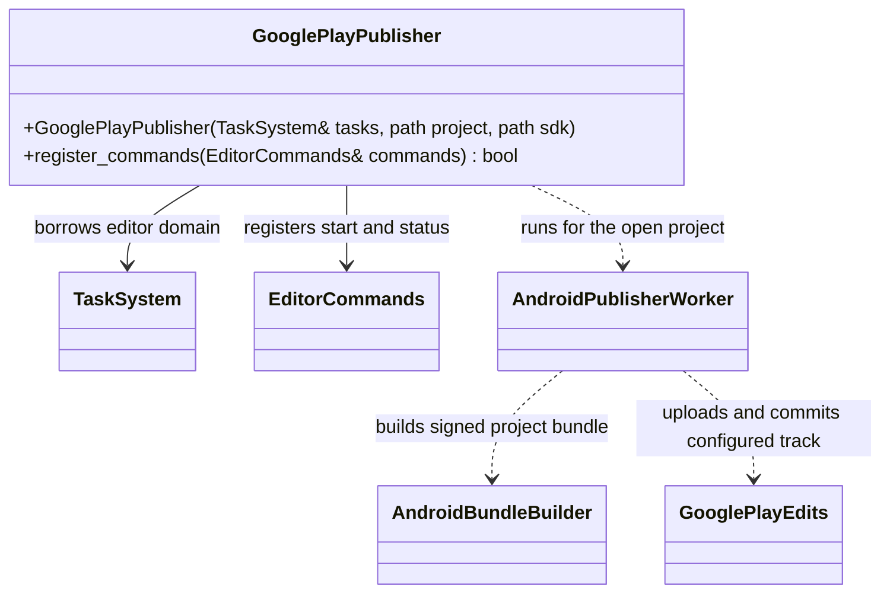

# Google Play 发布

编辑器宿主独占发布对象，命令仅操作当前打开的项目。同一对象一次接受一个后台作业，宿主关闭时等待作业结束。项目选择的发布配置绑定包名、版本线、轨道、上传证书和服务帐号。构建和发布共享同一条签名 AAB 构建入口。

```mermaid
classDiagram
    class GooglePlayPublisher {
        +GooglePlayPublisher(TaskSystem& tasks, path project, path sdk)
        +register_commands(EditorCommands& commands) bool
    }
    GooglePlayPublisher --> TaskSystem : borrows editor domain
    GooglePlayPublisher --> EditorCommands : registers start and status
    GooglePlayPublisher ..> AndroidPublisherWorker : runs for the open project
    AndroidPublisherWorker ..> AndroidBundleBuilder : builds signed project bundle
    AndroidPublisherWorker ..> GooglePlayEdits : uploads and commits configured track
```

